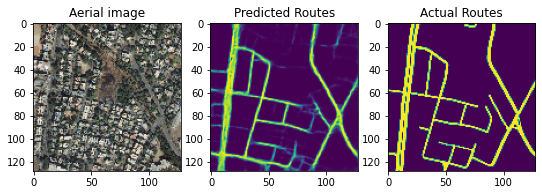
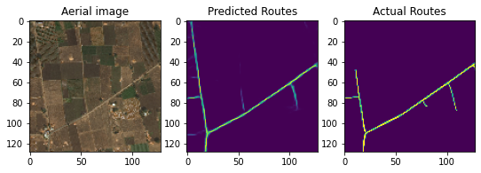
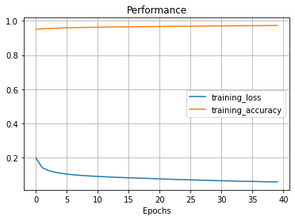

## Identificación de rutas en imágenes satelitales

### Link a nuestro código en colab.

* [Código Prueba 1:  _google colab_](https://colab.research.google.com/drive/1awV3qZSnQ75CeoSTZQ26sZ95xVeHlcev?authuser=1#scrollTo=U5cCY3PjQI4J)
* [Código Prueba 2: _google colab_](https://colab.research.google.com/drive/1rIJYTONLDwCyrFZVR-Uw0NPOGAADUE-j)

### Código Original de la prueba 2: (_Código utilizado funcional_)

* [Road maps from Aerial Images](https://www.kaggle.com/vanvalkenberg/road-maps-from-aerial-images)

### Método para identificar carreteras:

Para hacer la identificación de las carreteras se usó una [red neuronal convolusional U-Net](https://en.wikipedia.org/wiki/U-Net). De modo que dentro del código se puede ver que se tiene una función de la U-Net llamada "GiveMeUnet" y otra función previamente definida llamada "Conv2dBlock" que nos dará las convolusiones que se usan dentro de la U-Net. La arquitectura del algoritmo U-Net que se uso para este proyecto se muestra en la siguiente imagen:  

Para poder entrenar la red neuronal se usó una base de datos obtenida de kaggle que se puede acceder [desde aquí](https://www.kaggle.com/balraj98/massachusetts-roads-dataset). En esta base de datos hay varias carpetas con metadata, imágenes de entrenamiento y prueba. Dentro de las carpetas de entrenamiento se tiene una carpeta de imágenes obtenidas de satélite y otra carpeta con imágenes de entrenamiento en blanco y negro donde se denotan las carretras con blanco y lo que no es carretera en negro. En el código de python sólo se usaron las carpetas de entrenamiento y prueba. Cabe destacar que para poder usar el algoritmo tuvimos que modificar en el código original el tamaño de las imágenes de 256 a 128.

### Algunos resultados:

### Trabajo a Futuro:

* Hacer modificaciones a la U-Net para mejorar la identificación de carreteras.
* Modificar la función de optimización, la función de pérdida y la  métrica.
* Hacer un preprocesamiento de imágenes.
