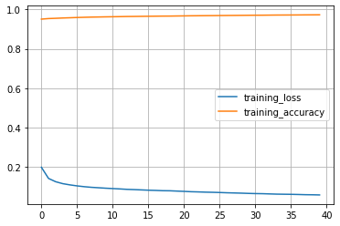

### Link a nuestro código en colab.

* [Código Prueba 1:  _google colab_](https://colab.research.google.com/drive/1awV3qZSnQ75CeoSTZQ26sZ95xVeHlcev?authuser=1#scrollTo=U5cCY3PjQI4J)
* [Código Prueba 2: _google colab_](https://colab.research.google.com/drive/1rIJYTONLDwCyrFZVR-Uw0NPOGAADUE-j)

### Código Original de la prueba 2:

[Road maps from Aerial Images](https://www.kaggle.com/vanvalkenberg/road-maps-from-aerial-images)

### Algunos resultados:

